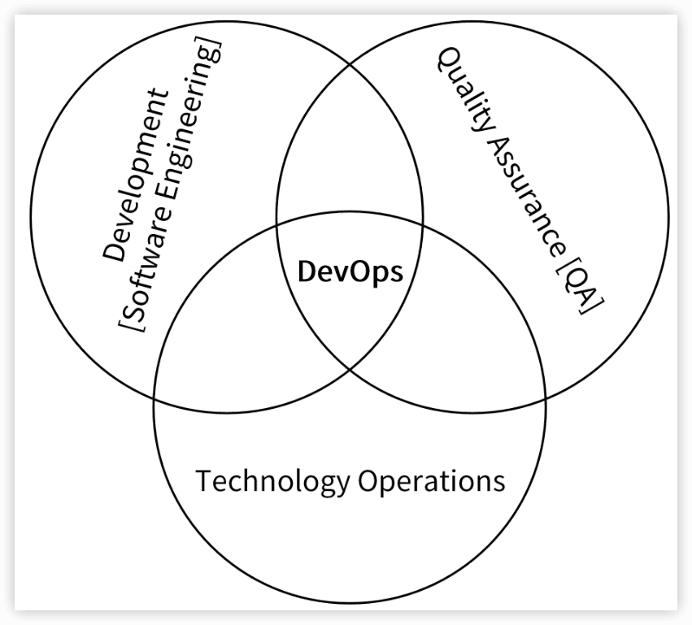

ron-iam
---

参考：[Go语言项目开发实战](https://time.geekbang.org/column/intro/100079601)

https://github.com/marmotedu/iam

[《Go 语言项目开发实战》课程补充](https://github.com/marmotedu/geekbang-go)


## 1 概述


Go应用的安全大体上分为2类：

- **服务自身的安全**：为了保证服务的安全，需要禁止非法用户访问服务。这可以通过服务器层面和软件层面来解决。

  **服务器层面**可以通过**物理隔离、网络隔离、防火墙**等技术从底层保证服务的安全性，

  **软件层面**可以通过**HTTPS、用户认证**等手段来加强服务的安全性。

  服务器层面一般由运维团队来保障，软件层面则需要开发者来保障。

- 服务资源的安全：服务内有很多资源，为了避免非法访问，开发者要避免 UserA 访问到 UserB 的资源，也即需要对资源进行授权。通常，可以通过**资源授权系统**来对资源进行授权。

对访问进行认证，对资源进行授权。

将认证和授权的功能实现升级为IAM系统。

### 1.1 IAM系统是什么？

IAM（Identity and Access Management，身份识别与访问管理）系统是用 Go 语言编写的一个 Web 服务，用于给第三方用户提供访问控制服务。

解决的问题是：**在特定的条件下，谁能够/不能够对哪些资源做哪些操作**（Who is able to do what on something given some context），也即完成资源授权功能。


1.  用户需要提供昵称、密码、邮箱、电话等信息注册并登录到IAM系统，这里是以用户名和密码作为唯一的身份标识来访问 IAM 系统，并且完成**认证**。
2.  因为访问IAM的资源授权接口是通过密钥（secretID/secretKey）的方式进行认证的，所以用户需要 IAM中创建属于自己的密钥资源。
3.  因为IAM通过授权策略完成授权，所以用户需要在IAM中创建**授权策略**。
4.  请求IAM提供的授权接口，IAM会根据用户的**请求内容和授权策略**来决定一个授权请求是否被允许。

在上面的流程中，IAM使用到了3种系统资源：用户（User）、密钥（Secret）和策略（Policy），映射到程序设计中就是3种RESTful资源：
•  ==用户（User）==：实现对用户的增、删、改、查、修改密码、批量修改等操作。
•  ==密钥（Secret）==：实现对密钥的增、删、改、查操作。
•  ==策略（Policy）==：实现对策略的增、删、改、查、批量删除操作。

### 1.2 IAM系统的架构


9大组件和3大数据库（Redis、MySQL和MongoDB）


#### 1️⃣通过使用流程理解架构

1. 创建平台资源。

用户通过 ==iam-webconsole==（RESTful API）或 ==iamctl==（sdk marmotedu-sdk-go）客户端请求 ==iam-apiserver== 提供的 RESTful API 接口完成用户、密钥、授权策略的增删改查，iam-apiserver 会将这些资源数据持久化存储在 MySQL 数据库中。而且，为了确保通信安全，客户端访问服务端都是通过 HTTPS 协议来访问的。

2. 请求 API 完成资源授权。

用户可以通过请求 ==iam-authz-server== 提供的 /v1/authz 接口进行**资源授权**，请求/v1/authz 接口需要通过密钥认证，认证通过后 /v1/authz 接口会查询授权策略，从而决定资源请求是否被允许。为了提高 /v1/authz 接口的性能，iam-authz-server 将密钥和策略信息缓存在内存中，以便实现快速查询。

那密钥和策略信息是如何实现缓存的呢？

首先，iam-authz-server 通过调用 iam-apiserver 提供的 gRPC 接口，将密钥和授权策略信息缓存到内存中。同时，为了使内存中的缓存信息和 iam-apiserver 中的信息保持一致，当 iam-apiserver 中有密钥或策略被更新时，iam-apiserver 会往特定的 Redis Channel（iam-authz-server 也会订阅该 Channel）中发送PolicyChanged 和 SecretChanged 消息。这样一来，当 iam-authz-server 监听到有新消息时就会获取并解析消息，根据消息内容判断是否需要重新调用 gRPC 接来获取密钥和授权策略信息，再更新到内存中。


3. 授权日志数据分析。

iam-authz-server 会将授权日志上报到 Redis 高速缓存中，然后 iam-pump 组件会异步消费这些授权日志，再把清理后的数据保存在 MongoDB 中，供运营系统 ==iam-operating-system== 查询。

> 注意：iam-authz-server 将授权日志保存在 Redis 高性能 key-value 数据库中，可以最大化减少写入延时。不保存在内存中是因为授权日志量我们没法预测，当授权日志量很大时，很可能会将内存耗尽，造成服务中断。

4. 运营平台授权数据展示。

iam-operating-system 是 IAM 的运营系统，它可以通过查询 MongoDB 获取并展示运营数据，比如某个用户的授权/失败次数、授权失败时的授权信息等。

此外，也可以通过 iam-operating-system 调用 iam-apiserver 服务来做些运营管理工作。比如，以上帝视角查看某个用户的授权策略供排障使用，或者调整用户可创建密钥的最大个数，再或者通过白名单的方式，让某个用户不受密钥个数限制的影响等等。


#### 2️⃣IAM软件架构模式

2种最常用的软件架构模式

##### 前后端分离架构

一般来说，运营系统的功能可多可少，对于一些具有复杂功能的运营系统，我们可以采用前后端分离的架构。其中，**前端负责页面的展示以及数据的加载和渲染，后端只负责返回前端需要的数据。**

IAM的运营系统 iam-operating-system


##### MVC架构

如果运营系统功能比较少，采用前后端分离框架的弊反而大于利，比如前后端分离要同时维护 2 个组件会导致部署更复杂，并且前后端分离将人员也分开了，这会增加一定程度的沟通成本。同时，因为代码中也需要实现前后端交互的逻辑，所以会引入一定的开发量。


## 2 环境准备：如何安装和配置一个基本的Go开发环境？

配置一个Go开发环境通过4步实现：

#### 2.1 Linux 服务器申请和配置


#### 2.2 依赖安装和配置


#### 2.3 Go编译环境安装和配置


ProtoBuf 编译环境安装：

- 安装protobuf的编译器 protoc

```sh
brew install protobuf

protoc --version
```

- 安装protoc-gen-go

> protoc 需要 protoc-gen-go 来完成 Go 语言的代码转换

```go
sudo go install github.com/golang/protobuf/protoc-gen-go@v1.5.2
```


#### 2.4 Go开发IDE安装和配置


## 3 项目部署：如何快速部署IAM系统？

了解 IAM 项目一个最直接有效的方式就是去部署和使用它。

### 下载iam项目代码


### 安装和配置数据库


### 安装和配置IAM系统


### 安装man文件


# 一、规范设计

## 4 规范设计（上）：项目开发杂乱无章，如何规范？

没有统一的规范，会造成一些问题：

- 代码风格不一
- 目录杂乱无章
- 接口不统一
- 错误码不规范

### 4.1 哪些地方需要制定规范

- 非编码类规范，主要包括开源规范、文档规范、版本规范、Commit 规范和发布规范。
- 编码类规范，则主要包括目录规范、代码规范、接口规范、日志规范和错误码规范。


### 4.2 开源规范

一个开源项目一定需要一个开源协议，开源协议规定了你在使用开源软件时的权利和责任，也就是规定了你可以做什么，不可以做什么。

#### 开源协议概述

常用6种开源协议：GPL、MPL、LGPL、Apache、BSD 和 MIT。


[开源协议介绍](https://github.com/marmotedu/geekbang-go/blob/master/开源协议介绍.md)

#### 开源规范特点

- 第一，开源项目，应该有一个**高的单元覆盖率**。这样，一方面可以确保第三方开发者在开发完代码之后，能够很方便地对整个项目做详细的单元测试，另一方面也能保证提交代码的质量。

- 第二，要确保整个代码库和提交记录中，不能出现**内部IP、内部域名、密码、密钥**这类信息。否则，就会造成**敏感信息**外漏，可能会对我们的内部业务造成安全隐患。

- 第三，当我们的开源项目被别的开发者提交 pull request、issue、评论时，要**及时处理**，一方面可以确保项目不断被更新，另一方面也可以激发其他开发者贡献代码的积极性。

- 第四，好的开源项目，应该能够**持续地更新功能，修复Bug**。对于一些已经结项、不维护的开源项目，需要及时地对项目进行归档，并在项目描述中加以说明。

[开源规范详细列表](https://github.com/marmotedu/geekbang-go/blob/master/开源规范详细列表.md)

> 提醒：
>
> 第一件，如果有条件，你可以宣传、运营开源项目，让更多的人知道、使用、贡献代码。比如，你可以在掘金、简书等平台发表文章，也可以创建 QQ、微信交流群等，都是不错的方式。
>
> 第二件，如果你英文好、有时间，文档最好有中英文 2 份，优先使用英文，让来自全球的开发者都能了解、使用和参与你的项目。

### 4.3 文档规范

文档属于**软件交付**的一个重要组成部分，没有文档的项目很难理解、部署和使用。

#### README规范

README模板:

```markdown
# 项目名称

<!-- 写一段简短的话描述项目 -->

## 功能特性

<!-- 描述该项目的核心功能点 -->

## 软件架构(可选)

<!-- 可以描述下项目的架构 -->

## 快速开始

### 依赖检查

<!-- 描述该项目的依赖，比如依赖的包、工具或者其他任何依赖项 -->

### 构建

<!-- 描述如何构建该项目 -->

### 运行

<!-- 描述如何运行该项目 -->

## 使用指南

<!-- 描述如何使用该项目 -->

## 如何贡献

<!-- 告诉其他开发者如果给该项目贡献源码 -->

## 社区(可选)

<!-- 如果有需要可以介绍一些社区相关的内容 -->

## 关于作者

<!-- 这里写上项目作者 -->

## 谁在用(可选)

<!-- 可以列出使用本项目的其他有影响力的项目，算是给项目打个广告吧 -->

## 许可证

<!-- 这里链接上该项目的开源许可证 -->
```

[在线的README生成工具](readme.so)

#### 项目文档规范

项目文档包括一切**需要文档化的内容**，通常集中放在`/docs`目录下。

好的文档规范有 2 个优点：易读和可以快速定位文档。

不同项目有不同的文档需求，在制定文档规范时，你可以考虑包含两类文档。

- **开发文档**：用来说明项目的==开发流程==，比如**如何搭建开发环境、构建二进制文件、测试、部署**等。
- **用户文档**：软件的==使用文档==，对象一般是软件的使用者，内容可根据需要添加。比如，可以包括**API文档、SDK文档、安装文档、功能介绍文档、最佳实践、操作指南、常见问题**等。

为了方便全球开发者和用户使用，开发文档和用户文档，可以预先规划好英文和中文 2 个版本。

实战项目的文档目录结构：

```
docs
├── devel                            # 开发文档，可以提前规划好，英文版文档和中文版文档
│   ├── en-US/                       # 英文版文档，可以根据需要组织文件结构
│   └── zh-CN                        # 中文版文档，可以根据需要组织文件结构
│       └── development.md           # 开发手册，可以说明如何编译、构建、运行项目
├── guide                            # 用户文档
│   ├── en-US/                       # 英文版文档，可以根据需要组织文件结构
│   └── zh-CN                        # 中文版文档，可以根据需要组织文件结构
│       ├── api/                     # API文档
│       ├── best-practice            # 最佳实践，存放一些比较重要的实践文章
│       │   └── authorization.md
│       ├── faq                      # 常见问题
│       │   ├── iam-apiserver
│       │   └── installation
│       ├── installation             # 安装文档
│       │   └── installation.md
│       ├── introduction/            # 产品介绍文档
│       ├── operation-guide          # 操作指南，里面可以根据RESTful资源再划分为更细的子目录，用来存放系统核心/全部功能的操作手册
│       │   ├── policy.md
│       │   ├── secret.md
│       │   └── user.md
│       ├── quickstart               # 快速入门
│       │   └── quickstart.md
│       ├── README.md                # 用户文档入口文件
│       └── sdk                      # SDK文档
│           └── golang.md
└── images                           # 图片存放目录
    └── 部署架构v1.png
```

#### API接口文档规范

接口文档又称为API文档，一般由**后台开发人员**编写，用来描述组件提供的 API 接口，以及如何调用这些 API 接口。

在项目初期，接口文档可以**解耦前后端**，让前后端并行开发：前端只需要按照接口文档实现调用逻辑，后端只需要按照接口文档提供功能。

在项目后期，接口文档可以提供给使用者，不仅可以降低组件的使用门槛，还能够减少沟通成本。

有**固定格式、结构清晰、内容完善**的接口文档。

接口文档有四种编写方式：编写Word格式文档、借助工具编写、通过注释生成和编写Markdown格式文档。


通过注释生成和编写 Markdown 格式文档这 2 种方式用得最多。本项目采用编写 Markdown 格式文档的方式，原因如下：

- 相比通过注释生成的方式，编写 Markdown 格式的接口文档，能表达**更丰富的内容和格式，不需要在代码中添加大量注释**。
- 相比 Word 格式的文档，Markdown 格式文档占用的**空间更小**，能够跟随代码仓库一起发布，方便 API 文档的分发和查找。
- 相比在线 API 文档编写工具，Markdown 格式的文档免去了第三方平台依赖和网络的限制。


一个规范的API接口文档，通常需要包含一个完整的 **API接口介绍文档、API接口变更历史文档、通用说明、数据结构说明、错误码描述和API接口使用文档**。API接口使用文档中需要包含**接口描述、请求方法、请求参数、输出参数和请求示例**。

接口文档拆分为以下几个 Markdown 文件，并存放在目录 [docs/guide/zh-CN/api](https://github.com/marmotedu/iam/tree/v1.0.0/docs/guide/zh-CN/api) 中：

- [README.md](https://github.com/marmotedu/iam/blob/master/docs/guide/zh-CN/api/README.md) ：API 接口介绍文档，会分类介绍 IAM 支持的 API 接口，并会存放相关 API 接口文档的链接，方便开发者查看。
- [CHANGELOG.md](https://github.com/marmotedu/iam/blob/master/docs/guide/zh-CN/api/CHANGELOG.md) ：API 接口文档变更历史，方便进行历史回溯，也可以使调用者决定是否进行功能更新和版本更新。
- [generic.md](https://github.com/marmotedu/iam/blob/master/docs/guide/zh-CN/api/generic.md) ：用来说明通用的请求参数、返回参数、认证方法和请求方法等。
- [struct.md](https://github.com/marmotedu/iam/blob/master/docs/guide/zh-CN/api/struct.md) ：用来列出接口文档中使用的数据结构。这些数据结构可能被多个 API 接口使用，会在 user.md、secret.md、policy.md 文件中被引用。
- [user.md](https://github.com/marmotedu/iam/blob/master/docs/guide/zh-CN/api/user.md) 、 [secret.md](https://github.com/marmotedu/iam/blob/master/docs/guide/zh-CN/api/secret.md) 、 [policy.md](https://github.com/marmotedu/iam/blob/master/docs/guide/zh-CN/api/policy.md) ：API 接口文档，相同 REST 资源的接口会存放在一个文件中，以 REST 资源名命名文档名。
- [error_code.md](https://github.com/marmotedu/iam/blob/master/docs/guide/zh-CN/api/error_code_generated.md) ：错误码描述，通过程序自动生成。

以`user.md`接口文档为例， 记录了用户相关的接口，每个接口按顺序排列包含5部分：

- **接口描述**：描述接口实现了什么功能。
- **请求方法**：接口的请求方法，格式为 `HTTP 方法 请求路径`，例如 `POST /v1/users`。在 **通用说明**中的**请求方法**部分，会说明接口的请求协议和请求地址。
- **输入参数**：接口的输入字段，它又分为 Header 参数、Query 参数、Body 参数、Path 参数。每个字段通过：**参数名称**、**必选**、**类型** 和 **描述** 4 个属性来描述。如果参数有限制或者默认值，可以在描述部分注明。
- **输出参数**：接口的返回字段，每个字段通过 **参数名称**、**类型** 和 **描述** 3 个属性来描述。
- **请求示例**：一个真实的 API 接口请求和返回示例。

### 4.4 版本规范

把所有组件都加入版本机制的好处：

- 一是通过版本号，我们可以很明确地知道组件是哪个版本，从而定位到该组件的功能和代码，方便我们定位问题。
- 二是发布组件时携带版本号，可以让使用者知道目前的项目进度，以及使用版本和上一个版本的功能差别等。

目前业界主流的版本规范是语义化版本规范。

#### 什么是语义化版本规范（SemVer）？

==语义化版本规范（SemVer，Semantic Versioning）==是 GitHub 起草的一个具有指导意义的、统一的版本号表示规范。它规定了版本号的表示、增加和比较方式，以及不同版本号代表的含义。

`主版本号.次版本号.修订号（X.Y.Z）`，其中 X、Y 和 Z 为非负的整数，且禁止在数字前方补零。

版本号可按以下规则递增：

- 主版本号（MAJOR）：当做了不兼容的 API 修改。
- 次版本号（MINOR）：当做了向下兼容的功能性新增及修改。这里有个不成文的约定，偶数为稳定版本，奇数为开发版本。
- 修订号（PATCH）：当做了向下兼容的问题修正。

还有把**先行版本号**（Pre-release）和**版本编译元数据**，作为延伸加到了`主版本号.次版本号.修订号`的后面，格式为 `X.Y.Z[-先行版本号][+版本编译元数据]`：


先行版本号意味着，该版本不稳定，可能存在兼容性问题，格式为：`X.Y.Z-[一连串以句点分隔的标识符]` ，比如：

```
1.0.0-alpha
1.0.0-alpha.1
1.0.0-0.3.7
1.0.0-x.7.z.92
```

编译版本号，一般是编译器在编译过程中自动生成的，我们只定义其格式，并不进行人为控制。比如：

```
1.0.0-alpha+001
1.0.0+20130313144700
1.0.0-beta+exp.sha.5114f85
```

> 注意，**先行版本号和编译版本号只能是字母、数字，且不可以有空格**。

#### 语义化版本控制规范

[详细语义化版本规范](https://semver.org/lang/zh-CN/)

- 标记版本号的软件发行后，禁止改变该版本软件的内容，任何修改都必须以新版本发行。
- 主版本号为零（0.y.z）的软件处于==开发初始阶段==，一切都可能随时被改变，这样的公共 API 不应该被视为稳定版。1.0.0 的版本号被界定为第一个稳定版本，之后的所有版本号更新都基于该版本进行修改。
- 修订号 Z（x.y.Z | x > 0）必须在只做了向下兼容的==修正==时才递增，这里的修正其实就是**Bug修复**。
- 次版本号 Y（x.Y.z | x > 0）必须在有向下兼容的==新功能==出现时递增，在任何公共 API 的功能被标记为弃用时也必须递增，当有改进时也可以递增。其中可以包括修订级别的改变。每当次版本号递增时，修订号必须归零。
- 主版本号 X（X.y.z | X > 0）必须在有任何==不兼容的修改==被加入公共API时递增。其中可以包括次版本号及修订级别的改变。**每当主版本号递增时，次版本号和修订号必须归零**。

#### 如何确定版本号？

几个经验：

第一，在实际开发的时候，我建议你使用 `0.1.0` 作为第一个开发版本号，并在后续的每次发行时递增次版本号。

第二，当我们的版本是一个稳定的版本，并且第一次对外发布时，版本号可以定为 `1.0.0`。

第三，当我们严格按照 Angular commit message 规范提交代码时，版本号可以这么来确定：

- `fix` 类型的 commit 可以将修订号+1。
- `feat` 类型的 commit 可以将次版本号+1。
- 带有 `BREAKING CHANGE` 的 commit 可以将主版本号+1。

## 5 规范设计（下）：commit 信息风格迥异、难以阅读，如何规范？

好的 Commit Message作用：

- **清晰地知道每个 commit 的变更内容**。
-  **进行过滤查找**，比如只查找某个版本新增的功能：`git log --oneline --grep "^feat|^fix|^perf"`。
- 基于规范化的 Commit Message **生成 Change Log**。
- 依据某些类型的 Commit Message **触发构建或者发布流程**，比如当 type 类型为 feat、fix 时才触发 CI 流程。

- **确定语义化版本的版本号**。比如 `fix` 类型可以映射为 PATCH 版本，`feat` 类型可以映射为 MINOR 版本。带有 `BREAKING CHANGE` 的 commit，可以映射为 MAJOR 版本。

### 5.1 Commit Message的规范有哪些？

社区有多种 Commit Message 的规范，例如 jQuery、Angular 等：


**[Angular](https://github.com/angular/angular)规范**在功能上能够满足开发者 commit 需求，在格式上清晰易读，目前也是用得最多的。


完整的符合 Angular 规范的 Commit Message:


在 Angular 规范中，Commit Message 包含三个部分，分别是 **Header**、**Body** 和 **Footer**：

```
<type>[optional scope]: <description>
// 空行
[optional body]
// 空行
[optional footer(s)]
```

其中，Header是必需的，Body和Footer可以省略。在以上规范中，`<scope>`必须用括号 `()` 括起来， `<type>[<scope>]` 后必须紧跟冒号 ，冒号后必须紧跟空格，2 个空行也是必需的。

实际开发中，为了更加易读，往往会限制每行 message 的长度，可以限制为 50/72/100 个字符。

#### Header

Header 部分只有一行，包括三个字段：**type**（必选）、**scope**（可选）和 **subject**（必选）。

type主要可以归为两类：

- **Development**：这类修改一般是**项目管理类的变更**，不会影响最终用户和生产环境的代码，比如 CI 流程、构建方式等的修改。遇到这类修改，通常也意味着可以免测发布。
- **Production**：这类修改会影响最终的用户和生产环境的代码。所以对于这种改动，我们一定要慎重，并在提交前做好充分的测试。

在做 Code Review 时，如果遇到 Production 类型的代码，一定要认真 Review，因为这种类型，会影响到现网用户的使用和现网应用的功能。


如何确定一个 commit 所属的 type 呢？


> **一定要保证一个项目中的 type 类型一致。**

scope 是用来说明 commit 的**影响范围**的，必须是**名词**。显然，不同项目会有不同的 scope。在项目初期，我们可以设置一些**粒度**比较大的 scope，比如可以按**组件名或者功能**来设置 scope；后续，如果项目有变动或者有新功能，我们可以再用追加的方式添加新的 scope。

例如，本项目主要是根据组件名和功能来设置的：apiserver、authzserver、user等。

| scope       | description                            |
| ----------- | -------------------------------------- |
| apiserver   | iam-apiserver 组件相关的变更           |
| authzserver | iam-auth-server 组件相关的变更         |
| pump        | iam-pump 组件相关的变更                |
| iamctl      | iamctl 组件相关的变更                  |
| user        | iam-apiserver 中 user 模块相关的变更   |
| policy      | iam-apiserver 中 policy 模块相关的变更 |
| secret      | iam-apiserver 中 secret 模块相关的变更 |
| pkg         | pkg 包的变更                           |
| docs        | 文档类变更                             |
| changelog   | CHANGELOG 的变更                       |
| makefile    | Makefile 文件的变更                    |

**scope 不适合设置太具体的值**。

subject 是 commit 的**简短描述**，必须以**动词开头、使用现在时**。比如，我们可以用 change，却不能用 changed 或 changes，而且这个动词的第一个字母必须是**小写**。通过这个动词，我们可以明确地知道 commit 所执行的操作。此外subject 的结尾**不能加英文句号**。

#### Body

对本次 commit 的更详细描述。

格式比较自由，可以有**要包括修改的动机**，以及 **和跟上一版本相比的改动点**等。

#### Footer

主要用来说明本次 commit 导致的后果。

在实际应用中，Footer通常用来说明**不兼容的改动和关闭的Issue列表**，格式如下：

```
BREAKING CHANGE: <breaking change summary>
// 空行
<breaking change description + migration instructions>
// 空行
// 空行
Fixes #<issue number>
```

- 不兼容的改动：如果当前代码跟上一个版本不兼容，需要在 Footer 部分，以 `BREAKING CHANG:` 开头，后面跟上不兼容改动的摘要。Footer 的其他部分需要说明变动的描述、变动的理由和迁移方法，例如：

```
BREAKING CHANGE: isolate scope bindings definition has changed and
    the inject option for the directive controller injection was removed.

    To migrate the code follow the example below:

    Before:

    scope: {
      myAttr: 'attribute',
    }

    After:

    scope: {
      myAttr: '@',
    }
    The removed `inject` wasn't generaly useful for directives so there should be no code using it.
```

- 关闭的 Issue 列表：关闭的 Bug 需要在 Footer 部分新建一行，并以 Closes 开头列出，例如：`Closes #123`。如果关闭了多个 Issue，可以这样列出：`Closes #123, #432, #886`。例如:

```
Change pause version value to a constant for image
    
    Closes #1137
```


#### Revert Commit

一种特殊情况：如果当前 commit 还原了先前的 commit，则应以 `revert:` 开头，后跟还原的 commit 的 Header。而且，在 Body 中必须写成 `This reverts commit <hash>` ，其中 hash 是要还原的 commit 的 SHA 标识。例如：

```
revert: feat(iam-apiserver): add 'Host' option

This reverts commit 079360c7cfc830ea8a6e13f4c8b8114febc9b48a.
```

> 为了更好地遵循Angular规范，建议在提交代码时养成不用 `git commit -m`，即不用-m 选项的习惯，而是直接用 `git commit` 或者 `git commit -a` 进入交互界面编辑 Commit Message。这样可以更好地格式化 Commit Message。

### 5.2 Commit相关的3个重要内容 🔖

#### 1️⃣提交频率


可以在最后合并代码或者提交 Pull Request 前，执行 `git rebase -i` 合并之前的所有 commit。

#### 2️⃣合并提交

- git rebase命令介绍

git rebase 的最大作用是它可以==重写历史==。

`git rebase -i <commit ID>`，`-i` 参数表示交互（interactive），该命令会进入到一个交互界面(Vim)中，可以对里面的 commit 做一些操作:


交互界面会首先列出给定`<commit ID>`之前（不包括 ，越下面越新）的所有 commit，每个 commit 前面有一个操作命令，默认是 pick。我们可以选择不同的 commit，并修改 commit 前面的命令，来对该 commit 执行不同的变更操作。

git rebase支持的变更操作如下：


- 合并提交操作示例

#### 3️⃣修改Commit Message

- git commit –amend：修改最近一次 commit 的 message
- git rebase -i：修改某次 commit 的 message


### 5.3 Commit Message规范自动化

Commit Message 规范如果靠文档去约束，就会严重依赖开发者的代码素养，并不能真正保证提交的 commit 是符合规范的。


## 6 目录结构设计：如何组织一个可维护、可扩展的代码目录？

目录结构是一个项目的门面。很多时候，根据目录结构就能看出开发者对这门语言的掌握程度。

### 6.1 如何规范目录？

目录规范，通常是指项目由**哪些目录**组成，每个目录下**存放什么文件、实现什么功能**，以及各个目录间的**依赖关系**是什么等。

一个好的目录结构至少要满足以下几个要求:

- **命名清晰**：目录命名要清晰、简洁，不要太长，也不要太短，目录名要能清晰地表达出该目录实现的功能，并且目录名最好用单数。一方面是因为单数足以说明这个目录的功能，另一方面可以统一规范，避免单复混用的情况。
- **功能明确**：一个目录所要实现的功能应该是明确的、并且在整个项目目录中具有很高的辨识度。也就是说，当需要新增一个功能时，我们能够非常清楚地知道把这个功能放在哪个目录下。
- **全面性**：目录结构应该尽可能全面地包含研发过程中需要的功能，例如文档、脚本、源码管理、API 实现、工具、第三方包、测试、编译产物等。
- **可观测性**：项目规模一定是从小到大的，所以一个好的目录结构应该能够在项目变大时，仍然保持之前的目录结构。
- **可扩展性**：每个目录下存放了同类的功能，在项目变大时，这些目录应该可以存放更多同类功能。

**根据功能，将目录结构分为结构化目录结构和平铺式目录结构两种**。结构化目录结构主要用在**Go应用**中，相对来说比较复杂；而平铺式目录结构主要用在**Go包**(代码框架/库)中，相对来说比较简单。

### 6.2 平铺式目录结构

平铺方式就是在项目的根目录下存放项目的代码，整个目录结构看起来更像是一层的。例如[glog](https://github.com/golang/glog):


### 6.3 结构化目录结构

当前Go社区比较推荐的结构化目录结构是 [project-layout](https://github.com/golang-standards/project-layout) 。

#### Go项目通常包含的功能

- 项目介绍：README.md。
- 客户端：xxxctl。
- API 文档。
- 构建配置文件，CICD 配置文件。
- CHANGELOG。
- 项目配置文件。
- kubernetes 部署定义文件（未来容器化是趋势，甚至会成为服务部署的事实标准，所以目录结构中需要有存放 kubernetes 定义文件的目录）。
- Dockerfile 文件。
- systemd/init 部署配置文件（物理机/虚拟机部署方式需要）。
- 项目文档。
- commit message 格式检查或者其他 githook。
- 请求参数校验。
- 命令行 flag。
- 共享包：
  - 外部项目可导入。
  - 只有子项目可导入。
- storage 接口。
- 项目管理：Makefile，完成代码检查、构建、打包、测试、部署等。
- 版权声明。
- _output 目录（编译、构建产物）。
- 引用的第三方包。
- 脚本文件（可能会借助脚本，实现一些源码管理、构建、生成等功能）。
- 测试文件。

#### 目录结构参考

结合project-layout和上面的Go项目常见功能，总结一套Go的代码结构组织方式：

```
├── api
│   ├── openapi
│   └── swagger
├── build
│   ├── ci
│   ├── docker
│   │   ├── iam-apiserver
│   │   ├── iam-authz-server
│   │   └── iam-pump
│   ├── package
├── CHANGELOG
├── cmd
│   ├── iam-apiserver
│   │   └── apiserver.go
│   ├── iam-authz-server
│   │   └── authzserver.go
│   ├── iamctl
│   │   └── iamctl.go
│   └── iam-pump
│       └── pump.go
├── configs
├── CONTRIBUTING.md
├── deployments
├── docs
│   ├── devel
│   │   ├── en-US
│   │   └── zh-CN
│   ├── guide
│   │   ├── en-US
│   │   └── zh-CN
│   ├── images
│   └── README.md
├── examples
├── githooks
├── go.mod
├── go.sum
├── init
├── internal
│   ├── apiserver
│   │   ├── api
│   │   │   └── v1
│   │   │       └── user
│   │   ├── apiserver.go
│   │   ├── options
│   │   ├── service
│   │   ├── store
│   │   │   ├── mysql
│   │   │   ├── fake
│   │   └── testing
│   ├── authzserver
│   │   ├── api
│   │   │   └── v1
│   │   │       └── authorize
│   │   ├── options
│   │   ├── store
│   │   └── testing
│   ├── iamctl
│   │   ├── cmd
│   │   │   ├── completion
│   │   │   ├── user
│   │   └── util
│   ├── pkg
│   │   ├── code
│   │   ├── options
│   │   ├── server
│   │   ├── util
│   │   └── validation
├── LICENSE
├── Makefile
├── _output
│   ├── platforms
│   │   └── linux
│   │       └── amd64
├── pkg
│   ├── util
│   │   └── genutil
├── README.md
├── scripts
│   ├── lib
│   ├── make-rules
├── test
│   ├── testdata
├── third_party
│   └── forked
└── tools
```


一个Go项目包含3大部分：**Go应用 、项目管理和文档**。所以，我们的项目目录也可以分为这3大类。同时，Go 应用又贯穿开发阶段、测试阶段和部署阶段，相应的应用类的目录，又可以按开发流程分为更小的子类。


#### Go应用：主要存放前后端代码

##### `/web`

前端代码存放目录，主要用来存放Web静态资源，服务端模板和单页应用（SPAs）。

##### `/cmd`

一个项目有很多组件，可以把组件 main 函数所在的文件夹统一放在`/cmd` 目录下。

```sh
$ tree cmd/
cmd/
├── gendocs
│   └── gen_iamctl_docs.go
├── geniamdocs
│   ├── gen_iam_docs.go
│   ├── gen_iam_docs_test.go
│   ├── postprocessing.go
│   └── postprocessing_test.go
├── genman
│   └── gen_iam_man.go
├── genswaggertypedocs
│   └── swagger_type_docs.go
├── genyaml
│   └── gen_iamctl_yaml.go
├── iam-apiserver
│   └── apiserver.go
├── iam-authz-server
│   └── authzserver.go
├── iam-pump
│   └── pump.go
├── iam-watcher
│   └── watcher.go
└── iamctl
    └── iamctl.go
```

每个组件的目录名应该跟你期望的可执行文件名是一致的。这里要保证 `/cmd/<组件名>` 目录下不要存放太多的代码，如果你认为代码可以导入并在其他项目中使用，那么它应该位于 /pkg 目录中。如果代码不是可重用的，或者你不希望其他人重用它，请将该代码放到 /internal 目录中。

##### `/internal`

存放**私有应用**和库代码。如果一些代码，你不希望在其他应用和库中被导入，可以将这部分代码放在`/internal` 目录下。

引入其它项目internal下的包时，编译时报错：

```
An import of a path containing the element “internal” is disallowed
if the importing code is outside the tree rooted at the parent of the
"internal" directory.
```

可以通过 Go 语言本身的机制来约束其他项目 import 项目内部的包。`/internal` 目录建议包含如下目录：

- /internal/apiserver：该目录中存放真实的应用代码。这些应用的共享代码存放在`/internal/pkg` 目录下。
- /internal/pkg：存放项目内可共享，项目外不共享的包。这些包提供了比较基础、通用的功能，例如工具、错误码、用户验证等功能。

建议：一开始将所有的共享代码存放在/`internal/pkg` 目录下，当该共享代码做好了对外开发的准备后，再转存到`/pkg`目录下。

```
internal/
├── apiserver
│   ├── api
│   │   └── v1
│   │       └── user
│   ├── options
│   ├── config
│   ├── service
│   │   └── user.go
│   ├── store
│   │   ├── mysql
│   │   │   └── user.go
│   │   ├── fake
│   └── testing
├── authzserver
│   ├── api
│   │   └── v1
│   ├── options
│   ├── store
│   └── testing
├── iamctl
│   ├── cmd
│   │   ├── cmd.go
│   │   ├── info
└── pkg
    ├── code
    ├── middleware
    ├── options
    └── validation
```

/internal 目录大概分为 3 类子目录：

- /internal/pkg：内部共享包存放的目录。
- /internal/authzserver、/internal/apiserver、/internal/pump、/internal/iamctl：应用目录，里面包含应用程序的实现代码。
- /internal/iamctl：对于一些大型项目，可能还会需要一个客户端工具。

在每个应用程序内部，也会有一些目录结构，这些目录结构主要根据功能来划分：

- /internal/apiserver/api/v1：HTTP API 接口的具体实现，主要用来做 HTTP 请求的解包、参数校验、业务逻辑处理、返回。注意这里的业务逻辑处理应该是轻量级的，如果业务逻辑比较复杂，代码量比较多，建议放到 /internal/apiserver/service 目录下。该源码文件主要用来串流程。
- /internal/apiserver/options：应用的 command flag。
- /internal/apiserver/config：根据命令行参数创建应用配置。
- /internal/apiserver/service：存放应用复杂业务处理代码。
- /internal/apiserver/store/mysql：一个应用可能要持久化的存储一些数据，这里主要存放跟数据库交互的代码，比如 Create、Update、Delete、Get、List 等。

/internal/pkg 目录存放项目内可共享的包，通常可以包含如下目录：

- /internal/pkg/code：项目业务 Code 码。
- /internal/pkg/validation：一些通用的验证函数。
- /internal/pkg/middleware：HTTP 处理链。

##### `/pkg`

/pkg 目录是 Go 语言项目中非常常见的目录，我们几乎能够在所有知名的开源项目（非框架）中找到它的身影，例如 Kubernetes、Prometheus、Moby、Knative 等。

该目录中存放可以被外部应用使用的代码库，其他项目可以直接通过 import 导入这里的代码。所以，在将代码库放入该目录时一定要慎重。

##### `/vendor`

项目依赖，可通过 `go mod vendor` 创建。需要注意的是，如果是一个 Go 库，不要提交 vendor 依赖包。

`/third_party`

外部帮助工具，分支代码或其他第三方应用（例如Swagger UI）。比如我们 fork 了一个第三方 go 包，并做了一些小的改动，我们可以放在目录/third_party/forked 下。一方面可以很清楚的知道该包是 fork 第三方的，另一方面又能够方便地和upstream同步。

#### Go应用：主要存放测试相关的文件和代码

`/test`

用于存放其他外部测试应用和测试数据。/test 目录的构建方式比较灵活：对于大的项目，有一个数据子目录是有意义的。例如，如果需要 Go 忽略该目录中的内容，可以使用/test/data 或/test/testdata 目录。

需要注意的是，**Go 也会忽略以“.”或 “_” 开头的目录或文件。**这样在命名测试数据目录方面，可以具有更大的灵活性。

#### Go应用：存放跟应用部署相关的文件

##### `/configs`

用来配置文件模板或默认配置。例如，可以在这里存放 confd 或 consul-template 模板文件。

> 注意：配置中不能携带敏感信息，这些敏感信息，可以用占位符来替代，如：
>
> ```yaml
> apiVersion: v1    
> user:    
>   username: ${CONFIG_USER_USERNAME} # iam 用户名    
>   password: ${CONFIG_USER_PASSWORD} # iam 密码
> ```

##### `/deployments`

用来存放 Iaas、PaaS 系统和容器编排部署配置和模板（Docker-Compose，Kubernetes/Helm，Mesos，Terraform，Bosh）。在一些项目，特别是用 Kubernetes 部署的项目中，这个目录可能命名为 `deploy`。

为什么要将这类跟 Kubernetes 相关的目录放到目录结构中呢？主要是因为当前软件部署基本都在朝着容器化的部署方式去演进。

##### `/init`

存放**初始化系统**（systemd，upstart，sysv）和**进程管理**配置文件（runit，supervisord）。比如 sysemd 的 unit 文件。这类文件，在非容器化部署的项目中会用到。

#### 项目管理：存放用来管理Go项目的各类文件

##### `/Makefile`

虽然 Makefile 是一个很老的项目管理工具，但它仍然是最优秀的项目管理工具。

Makefile通常用来执行静态代码检查、单元测试、编译等功能。其他常见功能，你可以参考这里： [Makefile常见管理内容](https://github.com/marmotedu/geekbang-go/blob/master/Makefile常见管理内容.md) 。

我还有一条建议：直接执行 make 时，执行如下各项 `format -> lint -> test -> build`，如果是有代码生成的操作，还可能需要首先生成代码 `gen -> format -> lint -> test -> build`。

在实际开发中，可以将一些重复性的工作自动化，并添加到 Makefile 文件中统一管理。

##### `/scripts`

该目录主要用来存放脚本文件，实现构建、安装、分析等不同功能。通常可以考虑包含以下3个目录：

- /scripts/make-rules：用来存放 makefile 文件，实现`/Makefile` 文件中的各个功能。Makefile 有很多功能，为了保持它的简洁，我建议你将各个功能的具体实现放在`/scripts/make-rules` 文件夹下。
- /scripts/lib：shell库，用来存放shell脚本。一个大型项目中有很多自动化任务，比如发布、更新文档、生成代码等，所以要写很多 shell 脚本，这些 shell 脚本会有一些通用功能，可以抽象成库，存放在`/scripts/lib` 目录下，比如 logging.sh，util.sh 等。
- /scripts/install：如果项目支持自动化部署，可以将自动化部署脚本放在此目录下。如果部署脚本简单，也可以直接放在/scripts 目录下。

另外，shell 脚本中的函数名，建议采用语义化的命名方式，例如 `iam::log::info` 这种语义化的命名方式，可以使调用者轻松的辨别出函数的功能类别，便于函数的管理和引用。在Kubernetes 的脚本中，就大量采用了这种命名方式。

##### `/build`

这里存放安装包和持续集成相关的文件。这个目录下有3个大概率会使用到的目录，在设计目录结构时可以考虑进去。

- /build/package：存放容器（Docker）、系统（deb, rpm, pkg）的包配置和脚本。
- /build/ci：存放 CI（travis，circle，drone）的配置文件和脚本。
- /build/docker：存放子项目各个组件的 Dockerfile 文件。

##### `/tools`

存放这个项目的支持工具。这些工具可导入来自/pkg 和/internal 目录的代码。

##### `/githooks`

Git 钩子。比如，我们可以将 commit-msg 存放在该目录。

##### `/assets`

项目使用的其他资源(图片、CSS、JavaScript 等)。

##### `/website`

如果你不使用 GitHub 页面，那么可以在这里放置项目网站相关的数据。

#### 文档：主要存放项目的各类文档

##### `/README.md`

项目的 README 文件一般包含了项目的介绍、功能、快速安装和使用指引、详细的文档链接以及开发指引等。有时候 README 文档会比较长，为了能够快速定位到所需内容，需要添加 markdown toc 索引，可以借助工具 [tocenize](https://github.com/nochso/tocenize) 来完成索引的添加。

这里还有个建议，前面我们也介绍过 README 是可以规范化的，所以这个 README 文档，可以通过脚本或工具来自动生成。

##### `/docs`

存放设计文档、开发文档和用户文档等（除了 godoc 生成的文档）。推荐存放以下几个子目录：

- /docs/devel/{en-US,zh-CN}：存放开发文档、hack 文档等。
- /docs/guide/{en-US,zh-CN}: 存放用户手册，安装、quickstart、产品文档等，分为中文文档和英文文档。
- /docs/images：存放图片文件。

##### `/CONTRIBUTING.md`

如果是一个开源就绪的项目，最好还要有一个 CONTRIBUTING.md 文件，用来说明**如何贡献代码，如何开源协同**等等。CONTRIBUTING.md 不仅能够规范协同流程，还能降低第三方开发者贡献代码的难度。

##### `/api`

/api 目录中存放的是当前项目对外提供的各种不同类型的 API 接口定义文件，其中可能包含类似 `/api/protobuf-spec`、`/api/thrift-spec`、`/api/http-spec`、`openapi`、`swagger` 的目录，这些目录包含了当前项目对外提供和依赖的所有 API 文件。例如，如下是 IAM 项目的/api 目录：

```markdown
├── openapi/
│   └── README.md
└── swagger/
    ├── docs/
    ├── README.md
    └── swagger.yaml
```

二级目录的主要作用，就是在一个项目同时提供了**多种不同的访问方式**时，可以分类存放。用这种方式可以避免潜在的冲突，也能让项目结构更加清晰。

##### `/LICENSE`

版权文件可以是私有的，也可以是开源的。常用的开源协议有：Apache 2.0、MIT、BSD、GPL、Mozilla、LGPL。有时候，公有云产品为了打造品牌影响力，会对外发布一个本产品的开源版本，所以在项目规划初期最好就能规划下未来产品的走向，选择合适的 LICENSE。

为了声明版权，你可能会需要将 LICENSE 头添加到源码文件或者其他文件中，这部分工作可以通过工具实现自动化，推荐工具： [addlicense](https://github.com/marmotedu/addlicense) 。

当代码中引用了其它开源代码时，需要在 LICENSE 中说明对其它源码的引用，这就需要知道代码引用了哪些源码，以及这些源码的开源协议，可以借助工具来进行检查，推荐工具： [glice](https://github.com/ribice/glice) 。至于如何说明对其它源码的引用，大家可以参考下 IAM 项目的 [LICENSE](https://github.com/marmotedu/iam/blob/master/LICENSE) 文件。

##### `/CHANGELOG`

当项目有更新时，为了方便了解当前版本的更新内容或者历史更新内容，需要将更新记录存放到 CHANGELOG 目录。编写 CHANGELOG 是一个复杂、繁琐的工作，我们可以结合 [Angular规范](https://github.com/angular/angular/blob/22b96b9/CONTRIBUTING.md#-commit-message-guidelines) 和 [git-chglog](https://github.com/git-chglog/git-chglog) 来自动生成 CHANGELOG。

##### `/examples`

存放应用程序或者公共包的示例代码。这些示例代码可以降低使用者的上手门槛。

#### 不建议的目录

##### `/src/`

一些开发语言，例如 Java 项目中会有 src 目录。在 Java 项目中， src 目录是一种常见的模式，但在 Go 项目中，不建议使用 src 目录。

其中一个重要的原因是：在默认情况下，Go 语言的项目都会被放置到`$GOPATH/src` 目录下。这个目录中存放着所有代码，如果我们在自己的项目中使用`/src` 目录，这个包的导入路径中就会出现两个 src，例如：

```bash
$GOPATH/src/github.com/marmotedu/project/src/main.go
```

这样的目录结构看起来非常怪。

##### `xxs/`

在 Go 项目中，要避免使用带复数的目录或者包。建议统一使用单数。

### 6.4 一些建议

一个小型项目用不到这么多目录。对于小型项目，可以考虑先包含 cmd、pkg、internal 3 个目录，其他目录后面按需创建，例如：

```csharp
$ tree --noreport -L 2 tms
tms
├── cmd
├── internal
├── pkg
└── README.md
```

另外，在设计目录结构时，一些**空目录**无法提交到 Git 仓库中，但我们又想将这个空目录上传到 Git 仓库中，以保留目录结构。这时候，可以在空目录下加一个 `.keep` 文件，例如：

```shell
$ ls -A build/ci/ 
.keep
```


## 7 工作流设计：如何设计合理的多人开发模式？

一个企业级项目是由多人合作完成的，不同开发者在本地开发完代码之后，可能提交到同一个代码仓库，同一个开发者也可能同时开发几个功能特性。这种多人合作开发、多功能并行开发的特性如果处理不好，就会带来诸如丢失代码、合错代码、代码冲突等问题。

在使用 Git 开发时，有4种常用的==工作流==（也叫==开发模式==），按演进顺序分为集中式工作流、功能分支工作流、Git Flow 工作流和Forking 工作流。

### 集中式工作流


A、B、C 为 3 位开发者，每位开发者都在本地有一份远程仓库的拷贝：**本地仓库**。A、B、C 在本地的 master 分支开发完代码之后，将修改后的代码commit到远程仓库，如果有冲突就**先解决本地的冲突再提交**。在进行了一段时间的开发之后，远程仓库 master 分支的日志可能如下图所示：


缺点：不同开发人员的提交日志混杂在一起，难以定位问题。如果同时开发多个功能，不同功能同时往 master 分支合并，代码之间也会相互影响，从而产生代码冲突。

集中式工作流程适合用在**团队人数少、开发不频繁、不需要同时维护多个版本的小项目**中。

### 功能分支工作流

功能分支工作流基于集中式工作流演进而来。在开发新功能时，基于 master 分支新建一个功能分支，在功能分支上进行开发，而不是直接在本地的 master 分支开发，开发完成之后合并到 master 分支，如下图所示：


相较于集中式工作流，这种工作流让不同功能**在不同的分支进行开发**，只在最后一步合并到master分支，不仅可以避免不同功能之间的相互影响，还可以使提交历史看起来更加简洁。

还有，在合并到 master 分支时，需要提交 ==PR==（pull request），而不是直接将代码merge到master分支。PR流程不仅可以把分支代码提供给团队其他开发人员进行 ==CR==（Code Review），还可以在 PR 页面讨论代码。通过 CR ，我们可以确保合并到 master 的代码是健壮的；通过PR页面的讨论，可以使开发者充分参与到代码的讨论中，有助于提高代码的质量，并且提供了一个代码变更的历史回顾途径。

功能分支工作流具体的开发流程：

1. 基于 master 分支新建一个功能分支，功能分支可以取一些有意义的名字，便于理解，例如feature/rate-limiting。

```sh
$ git checkout -b feature/rate-limiting
```


2. 在功能分支上进行代码开发，开发完成后 commit 到功能分支。

```sh
$ git add limit.go
$ git commit -m "add rate limiting"
```


3. 将本地功能分支代码 push 到远程仓库。

```sh
$ git push origin feature/rate-limiting
```


4. 在远程仓库上创建 PR（例如：GitHub）。

提交新的分支会在Github项目主页显示创建pr按钮，点击 **Compare & pull request** 提交 PR，如下图所示。


点击 **Compare & pull request** 后会进入 PR 页面，在该页面中可以根据需要填写评论，最后点击 **Create pull request** 提交 PR。


5. 代码管理员收到 PR 后，可以 CR 代码，CR 通过后，再点击 **Merge pull request** 将 PR 合并到 master


> “Merge pull request” 提供了 3 种 merge 方法：
>
> - **Create a merge commit：**GitHub 的底层操作是 `git merge --no-ff`。feature 分支上所有的 commit 都会加到 master 分支上，并且会生成一个 merge commit。这种方式可以让我们清晰地知道是谁做了提交，做了哪些提交，回溯历史的时候也会更加方便。
> - **Squash and merge**：GitHub 的底层操作是 `git merge --squash`。**Squash and merge**会使该 pull request 上的所有 commit 都合并成一个commit ，然后加到master分支上，但原来的 commit 历史会丢失。如果开发人员在 feature 分支上提交的 commit 非常随意，没有规范，那么我们可以选择这种方法来丢弃无意义的 commit。但是在大型项目中，每个开发人员都应该是遵循 commit 规范的，因此我不建议你在团队开发中使用 Squash and merge。
> - **Rebase and merge：**GitHub 的底层操作是 `git rebase`。这种方式会将 pull request 上的所有提交历史按照原有顺序依次添加到 master 分支的头部（HEAD）。因为git rebase 有风险，在你不完全熟悉 Git 工作流时，我不建议merge时选择这个。
>
> 在实际的项目开发中，比较推荐 **Create a merge commit** 方式。

功能分支工作流上手比较简单，不仅能使你并行开发多个功能，还可以添加code review，从而保障代码质量。

当然它也有缺点，就是**无法给分支分配明确的目的，不利于团队配合**。它适合用在**开发团队相对固定、规模较小的项目**中。

### Git Flow工作流

Git Flow工作流是一个非常成熟的方案，也是==非开源项目==中最常用到的工作流。它定义了一个围绕项目发布的严格分支模型，通过为代码开发、发布和维护分配独立的分支来让项目的迭代流程更加顺畅，**比较适合大型的项目或者迭代速度快的项目。**

#### Git Flow的5种分支

master、develop、feature、release和 hotfix

其中，master 和 develop 为常驻分支，其他为非常驻分支，不同的研发阶段会用到不同的分支。

| 分支名  | 描述                                                         |
| ------- | ------------------------------------------------------------ |
| master  | 该分支上的最新代码永远是发布状态，不能直接在该分支上开发。master 分支每合并一个 hotfx/release 分支，都会打一个版本标签 |
| develop | 该分支上的代码是开发中的最新代码，该分支只做合井操作，不能直接在该分支上开发 |
| feature | 在研发阶段用来做功能开发。一个新功能会基于 develop 分支新建一个 feature 分支，分支名建议命名为： feature/xxxx-xxx。功能开发完成之后，会合并到 develop 分支并删除。这里有一点需要你注意，feature 分支在申请合并之前，最好是先 pull 一下 develop 分支，看一下有没有冲突，如果有就先解决冲突后再申请合并 |
| release | 在发布阶段用作版本发布的预发布分支，基于 develop 分支创建，分支名建议命名为：release/xxxx-XxX。 例如：v1.0.0 版本的功能全部开发测试完成后，提交到 develop 分支，然后基于 develop 分支创建release/1.0.0分支，并提交测试，测试中遇到的问题在 release 分支修改。最终通过测试后，将 release 分支合并到 master 和 develop，并在 master 分支打上v1.0.0 的版本标签，最后删除 release/1.0.0分支 |
| hotfix  | 在维护阶段用作紧急 bug 修复分支，在 master 分支上创建，修复完成后合并到 master。分支名建议命名为hotfx/xxxx-xxx。例如：当线上某个版本出现 Bug 后，从 master 检出对应版本的代码，创建 hothx 分支，并在 hothx 分支修复问题。问题修复后，将 hothx 分支合并到 master 和 develop分支，并在 master 分支打上修复后的版本标签，最后删除 hotfix 分支 |

#### Git Flow开发流程 🔖


### Forking工作流

在开源项目中，最常用到的是Forking 工作流，例如 Kubernetes、Docker 等项目用的就是这种工作流。

fork 操作是在个人远程仓库新建一份目标远程仓库的副本，比如在 GitHub 上操作时，在项目的主页点击 fork 按钮（页面右上角），即可拷贝该目标远程仓库。Forking 工作流的流程如下图所示。


假设开发者 A 拥有一个远程仓库，如果开发者 B 也想参与 A 项目的开发，B 可以 fork 一份 A 的远程仓库到自己的 GitHub 账号下。后续 B 可以在自己的项目进行开发，开发完成后，B 可以给 A 提交一个 PR。这时候 A 会收到通知，得知有新的 PR 被提交，A 会去查看 PR 并 code review。如果有问题，A 会直接在 PR 页面提交评论，B 看到评论后会做进一步的修改。最后 A 通过 B 的 PR 请求，将代码合并进了 A 的仓库。这样就完成了 A 代码仓库新特性的开发。如果有其他开发者想给 A 贡献代码，也会执行相同的操作。

🔖

### 小结

| 工作流          | 优点                                                         | 缺点                                       | 使用场景                                                     |
| --------------- | ------------------------------------------------------------ | ------------------------------------------ | ------------------------------------------------------------ |
| 集中式工作流    | 上手最简单                                                   | 代码管理较混乱，容易出问                   | 团队人数少，开发不频繁，不需要同时维护多个版本的小项目       |
| 功能分支 工作流 | 上手比较简单，支持并行 开发，支持Code Review                 | 无法给分支分配明确的目的，不利于团队配合   | 开发团队相对固定、规模较小的项目                             |
| Git Flow 工作流 | 每个分支分工明确，这可以最大程度减少它们之间的相互影响，可以并行开发，支持Code Review | 一定的上手难度                             | 比较适合开发团队相对固定，规模较大的项目                     |
| ForkingI 作流   | 完全解耦个人远端仓库和项目远端仓库，最大程度上保证远端仓库的安全 | 对于职能分工明确且不对外开源的项目优势不大 | 比较适用于开源项目中，或者开发者有衍生出自己的衍生版的需求，或者开发者不固定，可能是任意一个能访问到项目的开发者 |


## 8 研发流程设计（上）：如何设计 Go 项目的开发流程？

在Go项目开发中，不仅要完成**产品功能的开发**，还要确保整个**过程是高效的，代码是高质量的**。这就离不开一套设计合理的==研发流程==了。

不合理的研发流程会带来很多问题：

- **代码管理混乱。**合并代码时出现合错、合丢、代码冲突等问题。
- **研发效率低。**编译、测试、静态代码检查等全靠手动操作，效率低下。甚至，因为没有标准的流程，一些开发者会漏掉测试、静态代码检查等环节。
- **发布效率低。**发布周期长，以及发布不规范造成的现网问题频发。

一种业界已经设计好的、相对标准的研发流程。可以基于这个流程来优化、定制，满足你自己的流程需求。

### 在设计研发流程时，需要关注哪些点？

不同的流程都会遵循这几个原则：

- 发布效率高：研发流程应该能提高发布效率，减少发布时间和人工介入的工作量。
- 发布质量高：研发流程应该能够提高发布质量，确保发布出去的代码是经过充分测试的，并且完全避免人为因素造成的故障。
- 迭代速度快：整个研发流程要能支持快速迭代，产品迭代速度越快，意味着产品的竞争力越强，在互联网时代越能把握先机。
- 明确性：整个研发流程中角色的职责、使用的工具、方法和流程都应该是明确的，这可以增强流程的可执行性。
- 流程合理：研发流程最终是供产品、开发、测试、运维等人员使用的，所以整个流程设计不能是反人类的，要能够被各类参与人员接受并执行。
- 柔性扩展：研发流程应该是柔性且可扩展的，能够灵活变通，并适应各类场景。
- 输入输出：研发流程中的每个阶段都应该有明确的输入和输出，这些输入和输出标志着上一个阶段的完成，下一个阶段的开始。

### 业界相对标准的研发流程，长啥样？

一个项目从立项到结项，中间会经历很多阶段。业界相对标准的划分，是把研发流程分为六个阶段，分别是**需求阶段、设计阶段、开发阶段、测试阶段、发布阶段、运营阶段**。其中，开发人员需要参与的阶段有4个：设计阶段、开发阶段、测试阶段和发布阶段。


每个阶段结束时，都需要有一个==最终的产出物==，可以是**文档、代码或者部署组件**等。这个产出物既是当前阶段的**结束里程碑**，又是下一阶段的**输入**。所以说，各个阶段不是割裂的，而是**密切联系的整体**。每个阶段又细分为很多步骤，这些步骤是需要不同的参与者去完成的工作任务。在完成任务的过程中，可能需要经过多轮的讨论、修改，最终形成定稿。

研发流程也是一种规范，**很难靠开发者的自觉性去遵守**。为了让项目参与人员尽可能地遵守规范，需要借助一些**工具、系统**来对他们进行强约束。所以，在我们设计完整个研发流程之后，需要认真思考下，有哪些地方可以实现**自动化**，有哪些地方可以靠工具、系统来保障规范的执行。[16]()

#### 1️⃣需求阶段

需求阶段是**将一个抽象的产品思路具化成一个可实施产品**的阶段。在这个阶段，产品人员会讨论**产品思路、调研市场需求**，并对需求进行分析，整理出一个比较完善的需求文档。最后，产品人员会组织相关人员对需求进行评审，如果评审通过，就会进入设计阶段。

**需求阶段，一般不需要研发人员参与。但这里，我还是建议你积极参与产品需求的讨论。**虽然我们是研发，但我们的视野和对团队的贡献，可以不仅仅局限在研发领域。

这里有个点需要提醒你，如果你们团队有测试人员，这个阶段也需要拉测试人员旁听下。因为了解产品设计，对测试阶段测试用例的编写和功能测试等都很有帮助。

需求阶段的产出物是一个通过评审的详细的==需求文档==。

#### 2️⃣设计阶段

| 工作项   | 具体内容                                                     |
| -------- | ------------------------------------------------------------ |
| 产品设计 | 由产品人员负责，设计出产品的形态、功能和交互，并输出详细的产品设计文档。该步骤最终将一个抽象的产品量化，变成一个可以实施的产品。后期的研发工作都是围绕着该产品文档进行的 |
| 交互设计 | 由交互设计师负责，参照产品设计文档，将产品用原型图和交互流程的形式展现出来 |
| 视觉设计 | 根据需求文档和交互设计原型设计出产品视觉界面。例如视觉风格定义、图标设计、页面设计和页面颜色等 |
| 技术设计 | 技术设计包含了很多内容，例如研发流程设计、研发规范设计、系统架构设计、软件架构设计、前端技术设计、后端技术设计、数据库、API 接口设计等，所有跟技术实现相关的点都可以在这一阶段进行设计 |
| 技术评审 | 所有的技术设计都需要经过技术评审，评审通过后才能进行实际的开发 |
| 需求排期 | 这一步，项目经理会组织产研人员对需求进行细化和排期，需求排期尽可能细分，这样才能更好地评估工作量和风险 |

这里的每一个设计项都应该经过反复的讨论、打磨，最终在团队内达成共识。这样可以确保设计是合理的，并减少返工的概率。**这里想提醒你的是，技术方案和实现都要经过认真讨论，并获得一致通过，否则后面因为技术方案设计不当，需要返工，你要承担大部分责任。**

对于后端开发人员，在设计技术方案之前，要做好充足的调研。一个技术方案，==不仅要调研业界优秀的实现，还要了解友商相同技术的实现==。只有这样，才可以确保我们的技术用最佳的方式实现。

除此之外，在这个阶段一些设计项可以并行，以缩短设计阶段的耗时。例如，产品设计和技术设计可以并行展开。另外，如果你们团队有测试人员，研发阶段最好也拉上测试人员旁听下，有利于后面的测试。

该阶段的产出物是==一系列的设计文档==，这些文档会指导后面的整个研发流程。

#### 3️⃣开发阶段

开发人员根据技术设计文档，编码实现产品需求。

开发阶段是整个项目的核心阶段，包含很多工作内容，而且每一个 Go 项目具体的步骤是不同的。


**开发阶段又可以分为“开发”和“构建”两部分**。

- 首先，我们需要制定一个所有研发人员共同遵循的 Git 工作流规范。最常使用的是 Git Flow 工作流或者 Forking 工作流。

​	为了提高开发效率，越来越多的开发者采用**生成代码的方式**来生成一部分代码，所以在真正编译之前可能还需要先生成代码，比如生成`.pb.go` 文件、API 文档、测试用例、错误码等。**我的建议是，在项目开发中，你要思考怎么尽可能自动生成代码。**这样不仅能提高研发效率，还能减少错误。

​	对于一个开源项目，我们可能还需要检查新增的文件是否有版权信息🔖。此外，根据项目不同，开发阶段还可能有其它不同的步骤。在流程的最后，通常会进行静态代码检查、单元测试和编译。编译之后，我们就可以启动服务，并进行自测了。

​	自测之后，我们可以遵循 Git Flow 工作流，将开发分支 push 到代码托管平台进行 code review。code review 通过之后，我们就可以将代码 merge 到 develop 分支上。

- 接下来进入构建阶段。这一阶段最好借助 CI/CD 平台实现自动化，提高构建效率。

​	合并到 develop 分支的代码同样需要进行代码扫描、单元测试，并编译打包。最后，我们需要进行归档，也就是将编译后的二进制文件或 Docker 镜像上传到制品库或镜像仓库。

上面整个开发阶段步骤很多，而且都是高频的操作。那**怎么提高效率呢**？你两种方法：

- 将开发阶段的步骤通过 Makefile 实现集中管理；
- 将构建阶段的步骤通过 CI/CD 平台实现自动化。

你还需要特别注意这一点：**在最终合并代码到 master 之前，要确保代码是经过充分测试的**。这就要求我们一定要借助代码管理平台提供的 Webhook🔖能力，在代码提交时触发 CI/CD 作业，对代码进行扫描、测试，最终编译打包，并以整个作业的成功执行作为合并代码的先决条件。

开发阶段的产出物是**满足需求的源代码、开发文档，以及编译后的归档文件**。

#### 4️⃣测试阶段

测试阶段由测试工程师（也叫质量工程师）负责，主要流程是：测试工程师根据需求文档创建测试计划、编写测试用例，并拉研发同学一起评审测试计划和用例。评审通过后，测试工程师就会根据测试计划和测试用例对服务进行测试。

**为了提高整个研发效率，测试计划的创建和测试用例的编写可以跟开发阶段并行。**

研发人员在交付给测试时，要提供自测报告、自测用例和安装部署文档。**这里我要强调的是：在测试阶段，为了不阻塞测试，确保项目按时发布，研发人员应该优先解决测试同学的Bug，至少是阻塞类的Bug。为了减少不必要的沟通和排障，安装部署文档要尽可能详尽和准确。**

另外，**你也可以及时跟进测试，了解测试同学当前遇到的卡点**。因为实际工作中，一些测试同学在遇到卡点时，不善于或者不会及时地跟你同步卡点，往往研发1分钟就可以解决的问题，可能要花测试同学几个小时或者更久的时间去解决。

当然，测试用例几乎不可能涵盖整个变更分支，所以对于一些难测，隐藏的测试，需要研发人员自己加强测试。

最后，一个大特性测试。

测试阶段的产出物是满足产品需求、达到发布条件的源代码，以及编译后的归档文件。

#### 5️⃣发布阶段

发布阶段主要是将软件部署上线，为了保证发布的效率和质量，需要遵循一定的发布流程：


发布阶段按照时间线排序又分为**代码发布、发布审批和服务发布**3个子阶段。

**首先，**开发人员首先需要将经过测试后的代码合并到主干，通常是 master 分支，并生成版本号，然后给最新的 commit 打上版本标签。之后，可以将代码 push 到代码托管平台，并触发 CI 流程，CI流程一般会执行代码扫描、单元测试、编译，最后将构建产物发布到制品库。CI流程中，我们可以根据需要添加任意功能。

**接着，**进入到发布审批阶段。首先需要申请资源，**资源申请周期可能会比较久，所以申请得越早越好，甚至资源申请可以在测试阶段发起。**在资源申请阶段，可以申请诸如服务器、MySQL、Redis、Kafka 之类资源。

资源申请通常是开发人员向运维人员提需求，由运维人员根据需求，在指定的时间前准备好各类资源。如果是物理机通常申请周期会比较久，但当前越来越多的项目选择容器化部署，这可以极大地缩短资源的申请周期。如果在像腾讯云弹性容器这类Serverless容器平台上部署业务，甚至可以秒申请资源。所以这里，我也建议优先采用容器化部署。

发布之前需要创建发布计划，里面需要详细描述本次的变更详情，例如变更范围、发布方案、测试结果、验证和回滚方案等。这里需要你注意，**在创建发布计划时，一定要全面梳理这次变更的影响点。**例如，是否有不兼容的变更，是否需要变更配置，是否需要变更数据库等。任何一个遗漏，都可能造成现网故障，影响产品声誉和用户使用。

接下来，需要创建发布单，在发布单中可以附上发布计划，并根据团队需求填写其它发布内容，发布计划需要跟相关参与者对齐流程、明确职责。发布单最终提交给审批人（通常是技术 leader）对本次发布进行审批，审批通过后，才可以进行部署。

**最后，**就可以进入到服务发布阶段，将服务发布到现网。在正式部署的时候，应用需要先部署到预发环境。在预发环境，产品人员、测试人员和研发人员会分别对产品进行验证。其中，产品人员主要验证产品功能的体验是否流畅，开发和测试人员主要验证产品是否有 Bug。预发环境验证通过，产品才能正式发布到现网。

> 建议：**编写一些自动化的测试用例，在服务发布到现网之后，对现网服务做一次比较充分的回归测试。**通过这个自动化测试，可以以最小的代价，最快速地验证现网功能，从而保障发布质量。
>
> 注意，**现网可能有多个地域，每个地域发布完成之后都要进行现网验证。**

发布阶段的产出物是正式上线的软件。

#### 6️⃣运营阶段

- **产品运营**：通过一系列的运营活动，比如线下的技术沙龙、线上的免费公开课、提高关键词排名或者输出一些技术推广文章等方式，来推高整个产品的知名度，提高产品的用户数量，并提高月活和日活。
- **运维**：由运维工程师负责，核心目标是确保系统稳定的运行，如果系统异常，能够及时发现并修复问题。长期目标是通过技术手段或者流程来完善整个系统架构，减少人力投入、提高运维效率，并提高系统的健壮性和恢复能力。

运维属于技术类，运营属于产品类。


在运营阶段，研发人员的主要职责就是**协助运维解决现网Bug，优化部署架构**。当然，研发人员可能也需要配合运营人员开发一些**运营接口**，供运营人员使用。

#### 所有角色和分工总结


| 简称 | 全称                                         | 主要职责                                                     |
| ---- | -------------------------------------------- | ------------------------------------------------------------ |
| PDM  | Product Manager 产品经理                     | 产品经理负责市场调查并根据用户的需求，确定开发何种产品，选择何种技术、商业模式，并推动相应产品的开发组织。他还要根据产品的生命周期，协调研发、营销、运营等，确定和组织实施相应的产品策略，以及其他一系列相关的产品管理活动。在一些小型团队，产品经理也会兼任项目经理的工作 |
| PM   | Project Manager 项目经理                     | 项目经理在不同的组织中，有不同的职责。在软件研发领域，项目经理的主要职责是负责日常管理工作，制定项目计划，确定需求排期，并按计划推进和跟踪项目进度。项目经理也会协调各角色定期同步进展，了解其中的问题和风险，并协调各种资源包括跨团队的资源，确保问题和风险及时解决，项目能够正常推进 |
| UX   | 交互设计师                                   | UX=UE=User Experience 交互设计师负责根据需求文档设计交互原型，关注用户体验流程、产品功 能架构、页面跳转流程、交互方式等。例如，交互设计师会使用 Axure 之类的工具绘制交互原型。并将原型提供给 UJI设计师进行进一步的设计 |
| UI   | User Interface 视觉设计师                    | 视觉设计师（或称界面设计师、UI 设计师）负责根据需求文档和交互设计原型设计出产品视觉界面。例如：视觉风格定义、图标设计、页面设计和页面颜色等 |
| RD   | Research and Development engineer 研发工程师 | 研发工程师负责具体需求的技术选型、架构设计、编码实现、测试和发布。研发工程师又细分为：前端开发工程师、APP 开发工程师和后台开发工程师。 。前端开发工程师：前端开发工程师负责根据需求文档和界面设计稿，利用 HTML/CSS/JavaScript/React/Vue 等技术，并调用服务端 API 接口完成前端界面的开发。 APP 开发工程师：负责根据需求文档和界面设计稿，并调用服务端 API 接口开发出移动端 APP 客户端。 ◎ 后台开发工程师：负责后台服务的开发，对外提供 HTTP/GRPC 接口供其它组件调用。 |
| QA   | Quality Assurance 质量保障                   | 在掌握质量管理方法概念的基础上，运用技术/业务知识，管控产品质量问题和风险，设计业务生命周期的流程规范，跟踪闭环，并建设度量体系，建设客观有效的目标，驱动问题解决。 |
| QE   | Quality Engineering 质量工程师               | 也叫测试工程师，软件质量的把关者，负责根据需求文档创建测试计划、编写测试和执行测试用例、发现并跟踪 Bug、记录测试结果等。测试工程师也负责自动化测试系统的搭建、自动化测试用例的编写、开发和执行 |
| OP   | Operation 运维工程师                         | 产品发布后，负责维护整个系统，同时不断优化系统架构，提升部署效率，提高资源利用率，确保服务的可用性，当服务器或者服务出故障时，及时介入解决，恢复系统 |


### 小结


## 9 研发流程设计（下）：如何管理应用的生命周期？

应用的生命周期管理就是指**采用一些好的工具或方法在应用的整个生命周期中对应用进行管理，以提高应用的研发效率和质量**。

### 9.1 应用生命周期管理技术有哪些？

可以**从两个维度来理解应用生命周期管理技术**。

1. 演进维度。

应用生命周期，最开始主要是通过研发模式来管理的，按时间线先后出现了瀑布模式、迭代模式、敏捷模式。接着，为了解决研发模式中的一些痛点出现了另一种管理技术，也就是CI/CD技术。随着CI/CD技术的成熟，又催生了另一种更高级的管理技术DevOps。

2. 管理技术的类别。

应用生命周期管理技术可以分为两类：

- ==研发模式==，用来确保整个研发流程是高效的。
- ==DevOps==，主要通过协调各个部门之间的合作，来提高软件的发布效率和质量。DevOps中又包含了很多种技术，主要包括CI/CD和多种Ops，例如AIOps、ChatOps、GitOps、NoOps等。其中，CI/CD技术提高了软件的发布效率和质量，而Ops技术则提高了软件的运维和运营效率。

尽管这些应用生命周期管理技术有很多不同，但是它们彼此支持、相互联系。研发模式专注于**开发过程**，DevOps技术里的CI/CD 专注于**流程**，Ops则专注于**实战。**


这两个维度涉及的管理技术虽然不少，但一共就是那几类。所以，**为了能够逻辑清晰地给你讲解明白这些技术，我会从演进维度来展开，也就是按照这样的顺序：研发模式（瀑布模式 -> 迭代模式 -> 敏捷模式） -> CI/CD -> DevOps**。

既然是演进，那这些技术肯定有优劣之分，应该怎么选择呢，一定是选择后面出现的技术吗？

为了解决你的这个问题，这里，对于研发模式和DevOps这两类技术的选择，我提前给出我的建议：**研发模式建议选择敏捷模式，因为它更能胜任互联网时代快速迭代的诉求。DevOps则要优先确保落地CI/CD技术，接着尝试落地ChatOps技术，如果有条件可以积极探索AIOps和GitOps。**

### 9.2 研发模式

#### 瀑布模式


#### 迭代模式

与瀑布式模式完全相反的开发过程：研发任务被切分为一系列轮次，每一个轮次都是一个迭代，每一次迭代都是一个从设计到实现的完整过程。它**不要求每一个阶段的任务都做到最完美，而是先把主要功能搭建起来，然后再通过客户的反馈信息不断完善**。

迭代开发可以帮助产品改进和把控进度，它的灵活性极大地提升了适应需求变化的能力，克服了高风险、难变更、复用性低的特点。

但是，迭代模式的问题在于比较专注于开发过程，**很少从项目管理的视角去加速和优化项目开发过程**。

#### 敏捷模式

敏捷模式把一个大的需求分成多个、可分阶段完成的小迭代，每个迭代交付的都是一个可使用的软件。在开发过程中，软件要一直处于可使用状态。

敏捷模式中具有代表性的开发模式，是**Scrum开发模型**。

一个大的需求拆分成很多小的迭代，意味着开发过程中会有很多个开发、构建、测试、发布和部署的流程。这种高频度的操作会给研发、运维和测试人员带来很大的工作量，降低了工作效率。为了解决这个问题，CI/CD技术诞生了。

### 9.3 CI/CD：自动化构建和部署应用

CI/CD技术通过自动化的手段，来快速执行代码检查、测试、构建、部署等任务，从而提高研发效率，解决敏捷模式带来的弊端。

CI/CD包含了3个核心概念。

- **CI**：Continuous Integration，持续集成。
- **CD**：Continuous Delivery，持续交付。
- **CD**：Continuous Deployment，持续部署。

**首先是持续集成。**它的含义为：频繁地（一天多次）将开发者的代码合并到主干上。它的流程为：在开发人员完成代码开发，并push到Git仓库后，CI工具可以立即对代码进行扫描、（单元）测试和构建，并将结果反馈给开发者。持续集成通过后，会将代码合并到主干。

CI流程可以使应用软件的问题在开发阶段就暴露出来，这会让开发人员交付代码时更有信心。因为CI流程内容比较多，而且执行比较频繁，所以CI流程需要有自动化工具来支撑。

**其次是持续交付，**它指的是一种能够使软件在较短的循环中可靠发布的软件方法。

持续交付在持续集成的基础上，将构建后的产物自动部署在目标环境中。这里的目标环境，可以是测试环境、预发环境或者现网环境。

通常来说，持续部署可以自动地将服务部署到测试环境或者预发环境。因为部署到现网环境存在一定的风险，所以如果部署到现网环境，需要手工操作。手工操作的好处是，可以使相关人员评估发布风险，确保发布的正确性。

**最后是持续部署，**持续部署在持续交付的基础上，将经过充分测试的代码自动部署到生产环境，整个流程不再需要相关人员的审核。持续部署强调的是自动化部署，是交付的最高阶段。


持续集成、持续交付和持续部署强调的是持续性，也就是能够支持频繁的集成、交付和部署，这离不开自动化工具的支持，离开了这些工具，CI/CD就不再具有可实施性。持续集成的核心点在**代码**，持续交付的核心点在**可交付的产物**，持续部署的核心点在**自动部署。**

### 9.4 DevOps：研发运维一体化

CI/CD技术的成熟，加速了DevOps这种应用生命周期管理技术的成熟和落地。

DevOps（Development和Operations的组合）是**一组过程、方法与系统的统称**，用于促进开发（应用程序/软件工程）、技术运营和质量保障（QA）部门之间的沟通、协作与整合。这3个部门的相互协作，可以提高软件质量、快速发布软件。如下图所示：



要实现DevOps，需要一些工具或者流程的支持，CI/CD可以很好地支持DevOps这种软件开发模式，如果没有CI/CD自动化的工具和流程，DevOps就是没有意义的，CI/CD使得DevOps变得可行。

DevOps ！= CI/CD。DevOps是一组过程、方法和系统的统称，而CI/CD只是一种软件构建和发布的技术。

DevOps技术之前一直有，但是落地不好，因为没有一个好的工具来实现DevOps的理念。但是随着容器、CI/CD技术的诞生和成熟，DevOps变得更加容易落地。也就是说，这几年越来越多的人采用DevOps手段来提高研发效能。

DevOps中的四个Ops手段：AIOps、ChatOps、GitOps、NoOps。

#### AIOps：智能运维

AIOps通过搜集海量的运维数据，并利用机器学习算法，智能地定位并修复故障。

也就是说，AIOps在自动化的基础上，增加了智能化，从而进一步推动了IT运维自动化，减少了人力成本。

随着IT基础设施规模和复杂度的倍数增长，企业应用规模、数量的指数级增长，传统的人工/自动化运维，已经无法胜任愈加沉重的运维工作，而AIOps提供了一个解决方案。在腾讯、阿里等大厂很多团队已经在尝试和使用AIOps，并享受到了AIOps带来的红利。例如，故障告警更加灵敏、准确，一些常见的故障，可以自动修复，无须运维人员介入等。

#### ChatOps：聊着天就把事情给办了

ChatOps就是在一个聊天工具中，发送一条命令给 ChatBot 机器人，然后 ChatBot会执行预定义的操作。这些操作可以是执行某个工具、调用某个接口等，并返回执行结果。

这种新型智能工作方式的优势是它可以利用 ChatBot 机器人让团队成员和各项辅助工具连接在一起，以沟通驱动的方式完成工作。ChatOps可以解决人与人、人与工具、工具与工具之间的信息孤岛，从而提高协作体验和工作效率。


开发/运维/测试人员通过@聊天窗口中的机器人Bot来触发任务，机器人后端会通过API接口调用等方式对接不同的系统，完成不同的任务，例如持续集成、测试、发布等工作。机器人可以是我们自己研发的，也可以是开源的。目前，业界有很多流行的机器人可供选择，常用的有Hubot、Lita、Errbot、StackStorm等。

使用ChatOps可以带来以下几点好处。

- **友好、便捷**：所有的操作均在同一个聊天界面中，通过@机器人以聊天的方式发送命令，免去了打开不同系统，执行不同操作的繁琐操作，方式更加友好和便捷。
- **信息透明**：在同一个聊天界面中的所有同事都能够看到其他同事发送的命令，以及命令执行的结果，可以消除沟通壁垒，工作历史有迹可循，团队合作更加顺畅。
- **移动友好**：可以在移动端向机器人发送命令、执行任务，让移动办公变为可能。
- **DevOps 文化打造**：通过与机器人对话，可以降低项目开发中，各参与人员的理解和使用成本，从而使DevOps更容易落地和推广。

#### GitOps： 一种实现云原生的持续交付模型

GitOps是一种持续交付的方式。它的核心思想是将应用系统的声明性基础架构（YAML）和应用程序存放在Git版本库中。将Git作为交付流水线的核心，每个开发人员都可以提交拉取请求（Pull Request），并使用Git来加速和简化Kubernetes的应用程序部署和运维任务。

通过Git这样的工具，开发人员可以将精力聚焦在功能开发，而不是软件运维上，以此提高软件的开发效率和迭代速度。

使用GitOps可以带来很多优点，其中最核心的是：当使用Git变更代码时，GitOps可以自动将这些变更应用到程序的基础架构上。因为整个流程都是自动化的，所以部署时间更短；又因为Git代码是可追溯的，所以我们部署的应用也能够稳定且可重现地回滚。

我们可以从概念和流程上来理解GitOps，它有3个关键概念。

- **声明性容器编排**：通过Kubernetes YAML格式的资源定义文件，来定义如何部署应用。
- **不可变基础设施**：基础设施中的每个组件都可以自动的部署，组件在部署完成后，不能发生变更。如果需要变更，则需要重新部署一个新的组件。例如，Kubernetes中的Pod就是一个不可变基础设施。
- **连续同步**：不断地查看Git存储库，将任何状态更改反映到Kubernetes集群中。


GitOps的工作流程如下：

**首先，**开发人员开发完代码后推送到Git仓库，触发CI流程，CI流程通过编译构建出Docker镜像，并将镜像push到Docker镜像仓库中。Push动作会触发一个push事件，通过webhook的形式通知到Config Updater服务，Config Updater服务会从 webhook 请求中获取最新 push 的镜像名，并更新Git仓库中的Kubernetes YAML文件。

**然后，**GitOps的Deploy Operator服务，检测到YAML文件的变动，会重新从Git仓库中提取变更的文件，并将镜像部署到Kubernetes集群中。Config Updater 和 Deploy Operator 两个组件需要开发人员设计开发。

#### NoOps：无运维

NoOps即无运维，完全自动化的运维。在NoOps中不再需要开发人员、运营运维人员的协同，把微服务、低代码、无服务全都结合了起来，开发者在软件生命周期中只需要聚焦业务开发即可，所有的维护都交由云厂商来完成。

毫无疑问，NoOps是运维的终极形态，在我看来它像DevOps一样，更多的是一种理念，需要很多的技术和手段来支撑。当前整个运维技术的发展，也是朝着NoOps的方向去演进的，例如GitOps、AIOps可以使我们尽可能减少运维，Serverless技术甚至可以使我们免运维。相信未来NoOps会像现在的Serverless一样，成为一种流行的、可落地的理念。

### 9.5 如何选择合适的应用生命周期管理技术？

**首先，**根据团队、项目选择一个合适的研发模式。如果项目比较大，需求变更频繁、要求快速迭代，建议选择敏捷开发模式。敏捷开发模式，也是很多大公司选择的研发模式，在互联网时代很受欢迎。

**接着，**要建立自己的CI/CD流程。任何变更代码在合并到master分支时，一定要通过CI/CD的流程的验证。我建议，你在CI/CD流程中设置质量红线，确保合并代码的质量。

**接着，**除了建立CI/CD系统，我还建议将ChatOps带入工作中，尽可能地将可以自动化的工作实现自动化，并通过ChatOps来触发自动化流程。随着企业微信、钉钉等企业聊天软件成熟和发展，ChatOps变得流行和完善。

**最后，**GitOps、AIOps可以将部署和运维自动化做到极致，在团队有人力的情况下，值得探索。

**大厂普遍采用敏捷开发的模式，来适应互联网对应用快速迭代的诉求。**例如，腾讯的[TAPD](https://www.tapd.cn/)、[Coding](https://coding.net/)的Scrum敏捷管理就是一个敏捷开发平台。**CI/CD强制落地，ChatOps已经广泛使用，AIOps也有很多落地案例，GitOps目前还在探索阶段，NoOps还处在理论阶段。**


## 10 设计方法：怎么写出优雅的Go项目？🔖

Go开发各种各样的代码问题：代码不规范，难以阅读；函数共享性差，代码重复率高；不是面向接口编程，代码扩展性差，代码不可测；代码质量低下。

### 10.1 如何写出优雅的Go项目？

1. 为什么是Go项目，而不是Go应用？

Go项目是一个偏工程化的概念，不仅包含了Go应用，还包含了项目管理和项目文档：


2. 一个优雅的Go项目具有哪些特点？

一个优雅的Go项目，不仅要求我们的Go应用是优雅的，还要确保我们的项目管理和文档也是优雅的。

- 符合Go编码规范和最佳实践；
- 易阅读、易理解，易维护；
- 易测试、易扩展；
- 代码质量高。

写出一个优雅的Go项目就是**用“最佳实践”的方式去实现Go项目中的Go应用、项目管理和项目文档**。具体来说，就是编写高质量的Go应用、高效管理项目、编写高质量的项目文档。


### 10.2 编写高质量的Go应用


#### 代码结构

组织合理的代码结构是一个项目的门面。可以通过两个手段来组织代码结构：

1. 组织一个好的目录结构。
2. 选择一个好的模块拆分方法。做好模块拆分，可以使项目内模块职责分明，做到低耦合高内聚。

目前业界有两种模块拆分方法：按层拆分和按功能拆分。

**按层拆分**，最典型的是MVC架构中的模块拆分方式，将服务中的不同组件按访问顺序，拆分成了Model、View和Controller三层。

在Go项目中，按层拆分会带来很多问题。最大的问题是**循环引用**：相同功能可能在不同层被使用到，而这些功能又分散在不同的层中，很容易造成循环引用。

Go项目中最常见的拆分方法是**按功能拆分**。比如，一个订单系统，我们可以根据不同功能将其拆分成用户（user）、订单（order）和计费（billing）3个模块，每一个模块提供独立的功能，功能更单一：

```sh
pkg
├── billing
├── order
│   └── order.go
└── user
```


#### 代码规范

#### 代码质量


#### 编程哲学

#### 软件设计方法

如果说设计模式解决的是具体的场景，那么SOLID原则就是我们设计应用代码时的指导方针。

### 10.3 高效管理项目

高效的开发流程
使用Makefile管理项目
自动生成代码
善于借助工具
对接CI/CD

### 10.4 编写高质量的项目文档


## 11 设计模式：Go常用设计模式概述 🔖


### 11.1 创建型模式

创建型模式（Creational Patterns）提供了一种**在创建对象的同时隐藏创建逻辑**的方式，而不是使用 new 运算符直接实例化对象。

种类型的设计模式里，单例模式和工厂模式（具体包括简单工厂模式、抽象工厂模式和工厂方法模式三种）在Go项目开发中比较常用。

#### 单例模式

#### 工厂模式

### 11.2 结构型模式

结构型模式（Structural Patterns）的特点是**关注类和对象的组合**。

#### 策略模式

#### 模板模式

### 11.3 行为型模式

行为型模式（Behavioral Patterns）的特点是关注**对象之间的通信**。

#### 代理模式

#### 选项模式


# 二、基础功能设计或开发

## 12 API风格（上）：如何设计RESTful API？

### RESTful API介绍


### RESTful API设计原则

URI设计
REST资源操作映射为HTTP方法
统一的返回格式
API 版本管理
API命名
统一分页/过滤/排序/搜索功能
域名

### REST示例


## 13 API风格（下）：RPC API介绍

### RPC介绍

### gRPC介绍

### Protocol Buffers介绍

### gRPC示例

### RESTful VS gRPC


## 14 项目管理：如何编写高质量的Makefile？

### 熟练掌握Makefile语法

### 规划Makefile要实现的功能

### 设计合理的Makefile结构

### 掌握Makefile编写技巧

技巧1：善用通配符和自动变量
技巧2：善用函数
技巧3：依赖需要用到的工具
技巧4：把常用功能放在/Makefile中，不常用的放在分类Makefile中
技巧5：编写可扩展的Makefile
技巧6：将所有输出存放在一个目录下，方便清理和查找
技巧7：使用带层级的命名方式
技巧8：做好目标拆分
技巧9：设置OPTIONS
技巧10：定义环境变量
技巧11：自己调用自己


15 研发流程实战：IAM项目是如何进行研发流程管理的？

16 代码检查：如何进行静态代码检查？

17 API 文档：如何生成 Swagger API 文档 ？

18 错误处理（上）：如何设计一套科学的错误码？

19 错误处理（下）：如何设计错误包？

20 日志处理（上）：如何设计日志包并记录日志？

21 日志处理（下）：手把手教你从 0 编写一个日志包

22 应用构建三剑客：Pflag、Viper、Cobra 核心功能介绍

23 应用构建实战：如何构建一个优秀的企业应用框架？


# 三、服务开发

24 Web 服务：Web 服务核心功能有哪些，如何实现？

25 认证机制：应用程序如何进行访问认证？

26 IAM项目是如何设计和实现访问认证功能的？

27 权限模型：5大权限模型是如何进行资源授权的？

28 控制流（上）：通过iam-apiserver设计，看Web服务的构建

29 控制流（下）：iam-apiserver服务核心功能实现讲解


30 ORM：CURD 神器 GORM 包介绍及实战

31 数据流：通过iam-authz-server设计，看数据流服务的设计

32 数据处理：如何高效处理应用程序产生的数据？

33 SDK 设计（上）：如何设计出一个优秀的 Go SDK？

34 SDK 设计（下）：IAM项目Go SDK设计和实现

35 效率神器：如何设计和实现一个命令行客户端工具？


# 四、服务测试

36 代码测试（上）：如何编写 Go 语言单元测试和性能测试用例？

37 代码测试（下）：Go 语言其他测试类型及 IAM 测试介绍

38 性能分析（上）：如何分析 Go 语言代码的性能？

39 性能分析（下）：API Server性能测试和调优实战

# 五、服务部署

40 软件部署实战（上）：部署方案及负载均衡、高可用组件介绍

41 软件部署实战（中）：IAM 系统生产环境部署实战

42 软件部署实战（下）：IAM系统安全加固、水平扩缩容实战

43 技术演进（上）：虚拟化技术演进之路

44 技术演进（下）：软件架构和应用生命周期技术演进之路

45 基于Kubernetes的云原生架构设计

46 如何制作Docker镜像？

47 如何编写Kubernetes资源定义文件？

48 IAM 容器化部署实战

49 服务编排（上）：Helm服务编排基础知识

50 服务编排（下）：基于Helm的服务编排部署实战

51 基于 GitHub Actions 的 CI 实战